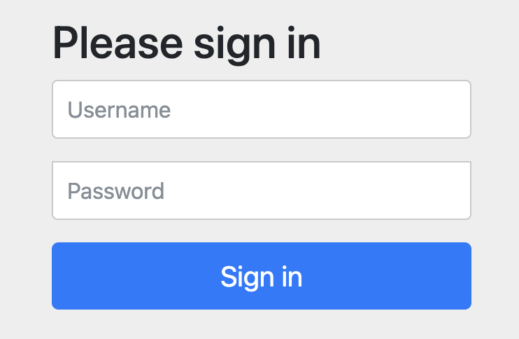
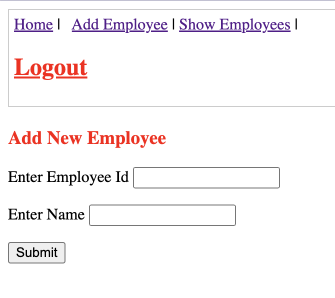

This is a demo to implement authentication and authourity by using spring security. There are two roles:user and admin.

**Login:** 

Username:user

Password:user

Username:admin

Password:admin

**Show Emploees:** can be used by both user and admin

**Add Employee:** can only be used by admin.

