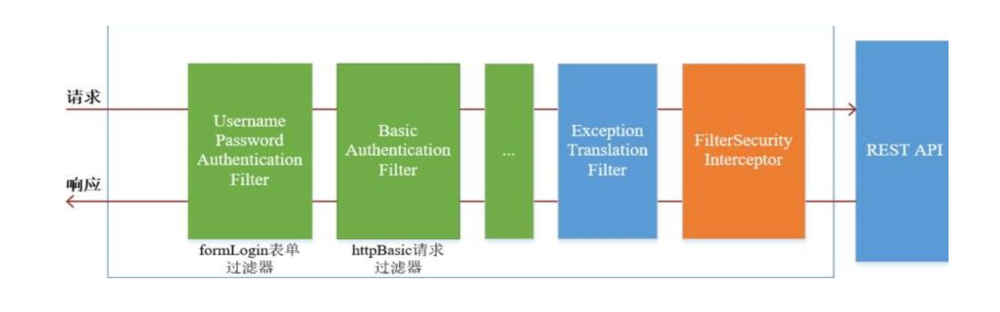
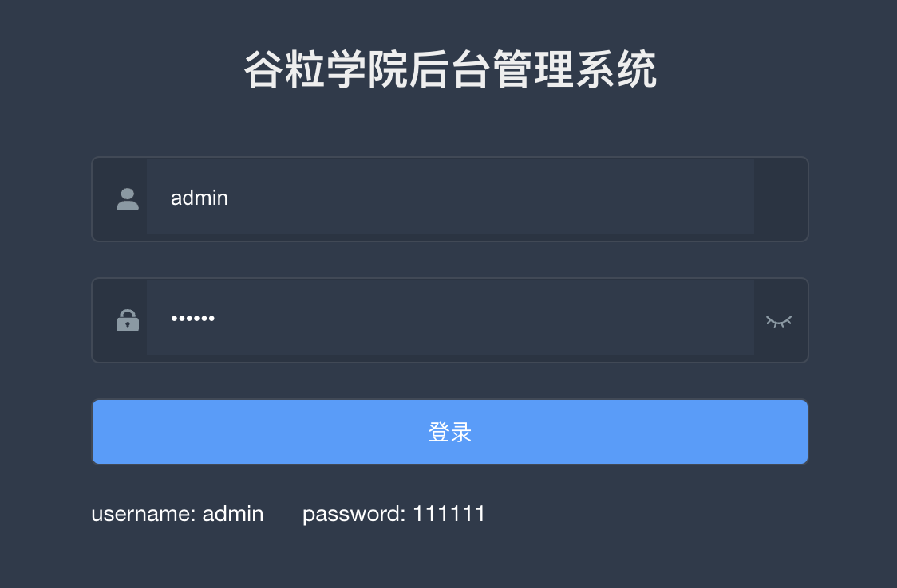
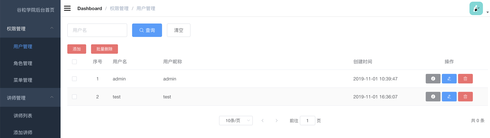

### **Introduction**

This demo is to show how to implement authentication and authorization on microservices architecture by using spring security.

### Techniques

| Technique                 | Detail         | Official Website                                |
| -------------------- | ------------------- | ---------------------------------------------- |
| SpringBoot           | 容器+MVC框架        | https://spring.io/projects/spring-boot         |
| SpringSecurity       | 认证和授权框架      | https://spring.io/projects/spring-security     |
| MyBatisPlus          | ORM框架             | http://www.mybatis.org/mybatis-3/zh/index.html |
| Redis                | 分布式缓存          | https://redis.io/                              |
| Mysql                | 数据库       | https://www.mysql.com/                            |
| Spring Cloud Gateway | 网关               | https://spring.io/projects/spring-cloud           |
| Nacos                | 注册中心          | https://nacos.io/en-us/                            |

### Architecture

acl-parent
├── common -- 工具类及通用代码

​			├──service_base -- common utils, handlers

​			├──spring_security -- the filers, configurations of spring security

├── infrastructure -- spring cloud gateway
├── service -- acl services,controllers,mappers,entities

DEMO

